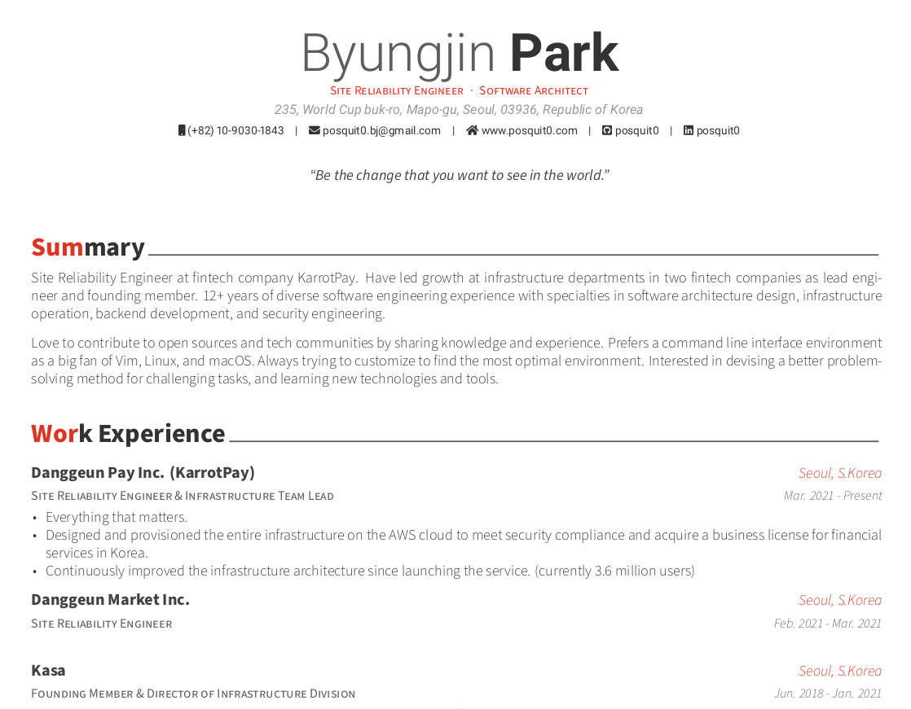
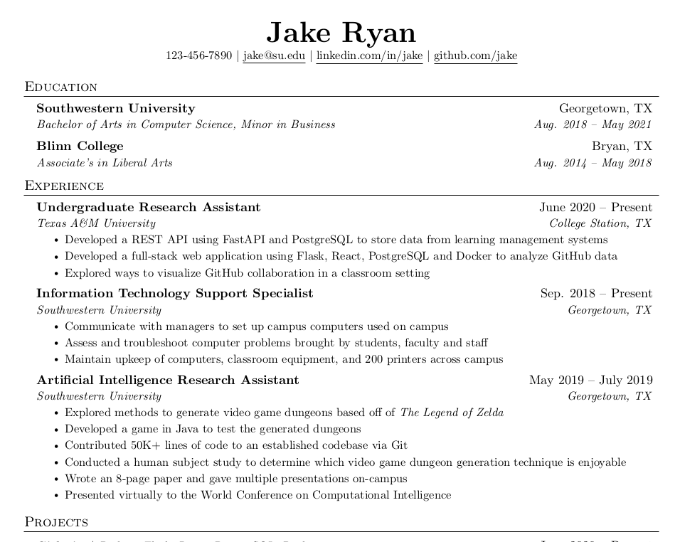
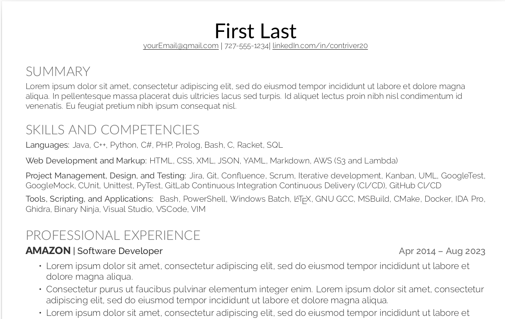

# Contriver20 Resume Templates

[](./LICENSE)

An easy to use repo to create a resume locally in multiple styles. 
If you want everything as code or you don't want to use an account on a site like overleaf.com,
this can be used instead. Originally created from other repos 
([awesome-cv](https://github.com/posquit0/Awesome-CV/tree/master/examples), 
[classic](https://github.com/jakegut/resume), [modern](https://github.com/Aarif123456/modern-deedy))

## Requirements

To build the pdfs an installations of `docker` and `make` are required on Linux OS. 
Instructions to install `make` are below. See the docker website for installation.

```bash
sudo apt update && sudo apt upgrade
sudo apt install build-essential
```

NOTE: This was tested on Ubunutu 22.04 VM.

## Template Previews

There are 3 different resume templates that are produced. The pdfs are placed in the pdfs directory. 

**Awesome**



**Classical**



**Modern**



## Builds
The templates can be produced with the initial command of `make`.
The `make` command will check if the latex image for docker has been created.
If not, then the docker will pull texlive image from docker hub. *This can
take up to 20 mins!* After the image build, the pdfs of each template will build.

To edit each resume, change the appropriate files and use the appropriate make command.
The classic and modern templates only need updates to [modern-resume.tex](modern/modern-resume.tex)
and [classic-resume.tex](classic/classic-resume.tex). The awesome template requires changes to the 
[awesome-resume.tex](awesome-cv/awesome-resume.tex) and all the files located in the 
[resume](awesome-cv/resume/) directory. Below are commands to regenerate each template instead of
building all 3 with `make`. 


```bash
make awesome
make classic
make modern
```